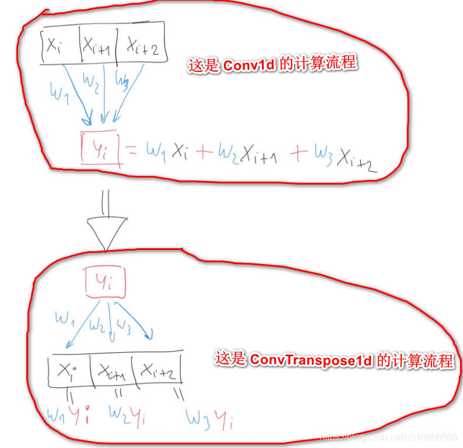
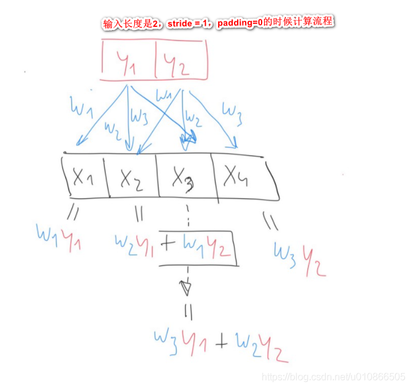

https://blog.csdn.net/u010866505/article/details/114091796

convtranspose1d是上采样

conv1d 是多个输入对应1个输出，如上面第一幅图的 [x1,x2,x3] -> y1(这里面的x1,x2,x3就是 Conv1d的输入，y1 是输出)

ConvTranspose1d 的是一个输入，对应多个输出,如上图 y1->[x1,x2,x3](这里面的x1,x2,x3就是 ConvTranspose1d的输出，y1 是输入)

Conv1d 在面前已经讲过了，这里主要说，其中 stride 和 padding 都是在输入 [x1,x2,x3]上面进行操作的。

但是，然而，but，ConvTranspose1d函数的stride 和 padding 是在输出 [x1,x2,x3] 上面进行操作的，跟 ConvTranspose1d 的输入 y 没有关系。
